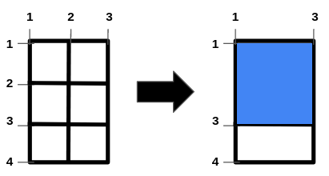
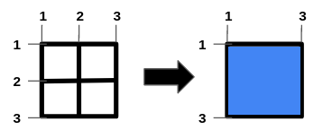
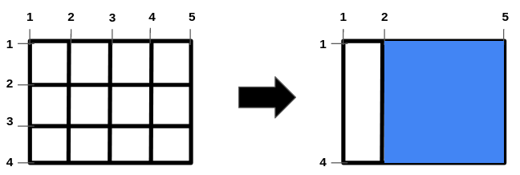

> *原题链接 [2943. 最大化网格图中正方形空洞的面积 - 力扣（LeetCode）](https://leetcode.cn/problems/maximize-area-of-square-hole-in-grid/description/)*  

给你一个网格图，由 `n + 2` 条 **横线段** 和 `m + 2` 条 **竖线段** 组成，一开始所有区域均为 `1 x 1` 的单元格。

所有线段的编号从 **1** 开始。

给你两个整数 `n` 和 `m` 。

同时给你两个整数数组 `hBars` 和 `vBars` 。

- `hBars` 包含区间 `[2, n + 1]` 内 **互不相同** 的横线段编号。
- `vBars` 包含 `[2, m + 1]` 内 **互不相同的** 竖线段编号。

如果满足以下条件之一，你可以 **移除** 两个数组中的部分线段：

- 如果移除的是横线段，它必须是 `hBars` 中的值。
- 如果移除的是竖线段，它必须是 `vBars` 中的值。

请你返回移除一些线段后（**可能不移除任何线段）**，剩余网格图中 **最大正方形** 空洞的面积，正方形空洞的意思是正方形 **内部** 不含有任何线段。

 

**示例 1：**



```
输入：n = 2, m = 1, hBars = [2,3], vBars = [2]
输出：4
解释：左边的图是一开始的网格图。
横线编号的范围是区间 [1,4] ，竖线编号的范围是区间 [1,3] 。
可以移除的横线段为 [2,3] ，竖线段为 [2] 。
一种得到最大正方形面积的方法是移除横线段 2 和竖线段 2 。
操作后得到的网格图如右图所示。
正方形空洞面积为 4。
无法得到面积大于 4 的正方形空洞。
所以答案为 4 。
```

**示例 2：**



```
输入：n = 1, m = 1, hBars = [2], vBars = [2]
输出：4
解释：左边的图是一开始的网格图。
横线编号的范围是区间 [1,3] ，竖线编号的范围是区间 [1,3] 。
可以移除的横线段为 [2] ，竖线段为 [2] 。
一种得到最大正方形面积的方法是移除横线段 2 和竖线段 2 。
操作后得到的网格图如右图所示。
正方形空洞面积为 4。
无法得到面积大于 4 的正方形空洞。
所以答案为 4 。
```

**示例 3：**



```
输入：n = 2, m = 3, hBars = [2,3], vBars = [2,3,4]
输出：9
解释：左边的图是一开始的网格图。
横线编号的范围是区间 [1,4] ，竖线编号的范围是区间 [1,5] 。
可以移除的横线段为 [2,3] ，竖线段为 [2,3,4] 。
一种得到最大正方形面积的方法是移除横线段 2、3 和竖线段 3、4 。
操作后得到的网格图如右图所示。
正方形空洞面积为 9。
无法得到面积大于 9 的正方形空洞。
所以答案为 9 。
```

 

**提示：**

- `1 <= n <= 109`
- `1 <= m <= 109`
- `1 <= hBars.length <= 100`
- `2 <= hBars[i] <= n + 1`
- `1 <= vBars.length <= 100`
- `2 <= vBars[i] <= m + 1`
- `hBars` 中的值互不相同。
- `vBars` 中的值互不相同。

<!-- more -->


解题思路：

单独分析每一条边，只需要考虑

- 长：最长能组成的连续长度 a，即求最长上升**子串**长度
- 宽：最长能组成的连续长度 b，即求最长上升**子串**长度

答案即为 $min(a, b) ^ 2$

```java
class Solution {
    public int maximizeSquareHoleArea(int n, int m, int[] hBars, int[] vBars) {
        Arrays.sort(hBars);
        Arrays.sort(vBars);
        int maxH = 2;
        int maxV = 2;
        int count = 2;
        // 求宽
        for (int i = 1; i < hBars.length; i ++) {
            maxH = Math.max(maxH, count);
            if (hBars[i] == hBars[i-1] + 1) {
                count ++;
            } else {
                count = 2;
            }
        }
        maxH = Math.max(maxH, count);
        // 求长
        count = 2;
        for (int i = 1; i < vBars.length; i ++) {
            maxV = Math.max(maxV, count);
            if (vBars[i] == vBars[i-1] + 1) {
                count ++;
            } else {
                count = 2;
            }
        }
        maxV = Math.max(maxV, count);
        int min = Math.min(maxH, maxV);
        return min * min;
    }
}
```

